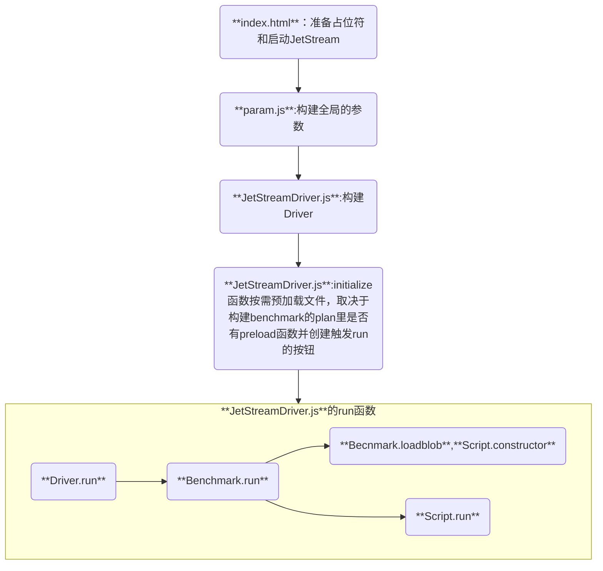
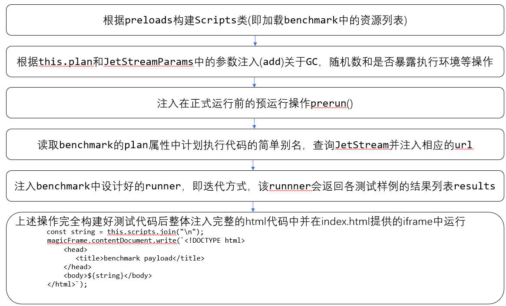

# JetStream 3 代码分析

## 文件目录

|文件名|功能|
|--|--|
|index.html|JetStream 3的入口文件,也是JetSream 3主要逻辑的执行环境|
|JetStreamDriver.js|加载文件，运行测试，计算结果均在此文件|
|param.js|构建测试的参数|
|ARES-6/air|聚焦底层编译细节（无复杂业务逻辑，仅针对IR管线、寄存器分配等低层级操作）|
|ARES-6/basic|基于 ECMA-55 BASIC 标准实现，专门测试JS引擎对**生成器（含递归生成器、多 yield 点）**的执行性能|
|ARES-6/Babylon|测试JS引擎对ES6语法解析的性能属于是真实案例|
|ARES-6/ML|测试ES6类密集型、复杂计算场景的执行性能|
|cdjs|聚焦JavaScript引擎通用基础场景的专项性能测试集|
|code-load|从JS代码被浏览器/引擎获取（加载）到完成解析、预处理，最终准备执行这一前置流程的性能表现|
|octane|经典测试集，覆盖面广泛|
|RexBench|正则表达式（Regular Expression）处理管线|
|simple|JS引擎最基础的语法支持和运行可用性|
|SeaMonster||
|BigInt|聚焦JavaScript原生BigInt类型的全流程处理性能|
|Proxy|聚焦JavaScript原生Proxy的全流程处理性能|
|class-fields|针对JavaScript中Class Fields（类字段，含 ES6 + 公共类字段、私有类字段、静态类字段）特性的专项测试组件|
|Generators|针对 JavaScript 中生成器的测试组件|
|wasm|针对 WebAssembly（Wasm）技术全流程性能|
|worker|针对JavaScript Web中Worker（含普通Web Worker、SharedWorker）多线程特性|
|WSL|小型JS脚本的快速加载、解析与执行性能，侧重轻量级脚本的运行效率|
|8bitbench|8 位低精度数值的运算、数据处理性能，针对字节级数据操作的专项测试|
|wasm/zlib|Wasm 版 zlib 压缩 / 解压算法的执行性能，聚焦 Wasm 在数据压缩场景的表现|
|wasm/dotnet|.NET 程序编译为 Wasm 模块后的运行性能，验证 .NET 到 Wasm 跨平台编译的效率|
|wasm/j2cl-box2d|J2CL（Java转Closure再转 Wasm）编译的 Box2D 物理引擎 Wasm 模块性能，侧重游戏物理模拟场景|
|prismjs|Prism代码高亮库的运行性能，测试语法解析、代码着色等前端工具的执行效率|
|intl|JavaScript Intl API 的国际化处理性能，包括日期格式化、语言排序、数字本地化等场景|
|SunSpider|经典 JS 基础语法与运算性能测试，覆盖数组操作、字符串处理、数学运算等基础场景|
|web-tooling-benchmark|前端工程化工具链的运行性能，测试 Babel、ESLint 等工具的代码转译、校验效率|

## 执行概述

下面以运行SunSpider为例进行流程概述:



## index_html

**index.html**只实现了和浏览器有关的操作(检查查询参数是否合法),其它的测试内容都只有占位符有待填充,整个页面通过```javascript await JetStream.initialize();```自启动。在正式启动前会先执行[params.js](#param-js)和[JetStreamDriver.js](#jetstreamdriver-js)中的全局代码。

``` javascript
    const isInBrowser = true;
    const isD8 = false;
    const isSpiderMonkey = false;

    // ?. 表示可选链操作符，作用是防止属性不存在时抛出错误
    // location 是浏览环境下的特有属性即url，location.search则对应了url中的查询参数
    // 直接启动没有查询参数似乎不会触发该项
    if (globalThis?.location?.search) {
        //URLSearchParams：浏览器原生 API，专门用于解析和操作 URL 查询参数
        globalThis.JetStreamParamsSource = new URLSearchParams(globalThis?.location?.search);
    }
    globalThis.allIsGood = true;
    window.onerror = function(e) {
        if (e == "Script error.") {
            // This is a workaround for Firefox on iOS which has an uncaught exception from
            // its injected script. We should not stop the benchmark from running due to that
            // if it can otherwise run.
            return;
        }
        globalThis.allIsGood = false;
    }

    async function initialize() {
        if (!JetStreamParams.isDefault) {
            showNonDefaultParams();
        }
        if (globalThis.allIsGood) {
            try {
                await JetStream.initialize();
            } catch (e) {
                globalThis.allIsGood = false;
                console.error(e);
            }
        }
        if (!globalThis.allIsGood) {
            let statusElement = document.getElementById("status");
            statusElement.classList.remove('loading');
            statusElement.classList.add('error');
            statusElement.innerHTML = "<h2>ERROR</h2><p>Errors were encountered during page load. Refusing to run a partial benchmark suite.</p>";
        }
    }
    
    function showNonDefaultParams() {
        //在给出的css中找表格模板
        document.body.classList.add("nonDefaultParams"); 
        //获得表格的引用
        const body = document.querySelector("#non-standard-params-table tbody");
        const nonDefaultParams = JetStreamParams.nonDefaultParams;
        console.warn(`Using non standard params: ${JSON.stringify(nonDefaultParams, null, 2)}`)
        for (const [key, value] of  Object.entries(nonDefaultParams)) {
            const defaultValue = DefaultJetStreamParams[key]
            const row = body.insertRow();
            row.insertCell().textContent = key;
            row.insertCell().textContent = JSON.stringify(value);
            row.insertCell().textContent = JSON.stringify(defaultValue);
        }
    }

```

### 补充

- globalThis 不只是 浏览器的全局变量，而是 ES2020（ES11）标准化的、跨所有 JavaScript 运行环境 的统一全局对象引用
- 关于meta属性中的viewport属性，详见 [博客](https://www.runoob.com/w3cnote/viewport-deep-understanding.html)

----------------------------------------

## JetStreamDriver.js {#jetstreamdriver-js}

### JetStreamDriver.js的类说明

**1.ShellFileLOader类**
**ShellFileLoader**类仅含有一个map属性```requesets```用于存储\[url,content]对。函数```javascript load(url)```用于加载压缩/未压缩的文件并写入```requesets```。

**2.Driver类**
**Driver**类的属性列表如下：

|属性|释义|
|--|--|
|isReady|准备信号|
|errors|错误列表|
|benchmarks|测试集的集合|
|blobDataCache|大二进制文件字典|
|counter|各种计数器字典，字典值对应计数器的数值|

**Driver**类的方法：
```async initialize()```方法调用异步函数```this.prefetchResources()```准备所需资源，并标记```javascript isReady```为true。在浏览器执行环境中会触发相关UI的创建(调用```this.prepareBrowserUI()```)，分发事件(```new Event("JetStreamReady")```),并在指定延迟(如果指定了的话)后执行异步函数```this.start()```开始进行测试。
```async prefetchResources```函数调用各个benchmark的```prefetchResourcesForBrowser()/prefetchResourcesForShell()```函数加载资源。在浏览器模式下，会尝试比较已加载的benchmark数量和总共需要加载的benchmark数量，若不一致会尝试重新加载仍然不一致直接抛出异常，如果一致则创建触发```this.start()```的按钮。
```async start()```主要用于实现webkit团队的评分逻辑，主要的执行部分在`benchmark.run()`

**3.Scripts类**
**Scripts**作为抽象类封装了测试脚本的通用初始化逻辑。构造器会创建包含
```preloadsCode += `${JSON.stringify(name)}: "${blobURLOrPath}",\n```
和```resourcesCode += `${JSON.stringify(resource)}: "${blobURLOrPath}",\n`;```
两组键值对的全局```JetStream```对象。同时提供了注入伪随机数函数```addDeterministicRandom()```和注入检测运行环境函数```addBrowserTest()```。其中```preloadsCode```实现“简单别称”到环境路径的映射,```resourcesCode```实现从原始资源路径到环境资源路径的映射(eg. `./src/resources/xxx.js`  ->  `https://JetStream/blob/xxx.js`)之后可以利用该映射检查某资源是否已被“预载”。
**ShellScripts**类继承**Scripts**类主要实现了抽象方法```run()```，该方法基于执行环境创建了独立于主环境的独立环境用于执行“自己”，即属性```this.scipts```。在执行过程中console浅拷贝主环境的console,performance在没有的情况下(??=)会借用主环境的。
**BrowserScripts**类继承**Scripts**类似于**ShellScripts**重写```run()```函数，通过使用**index.html**中的```html <iframe id="magic"></iframe>```作为新的环境。

**4.Benmark类**
**Benchmark**抽象类是测试集在Driver中进行运行的基本单位,通过调用```benchmark.run()```实现运行。```benchmark```的主要属性表如下：

|属性|说明|
|---|---|
|```plan```|benchmark包装了该类|
|```tags```|表示benchmark的种类，从plan属性中提取|
|```iterations```|迭代次数|
|```_state```|表示该benchmark在Driver中的执行状态，默认为```BenchmarkState.READY```|
|```scripts```|默认为null，存储待执行脚本|
|```preloads```|结合前面加载文件的方法，此处为存储预加载的代码|
|```results```|存储结果的列表|

```get runnerCode()```结合```get preIterationCode()```和```get prepareForNextIterationCode()```完成注入字符串的生成。迭代完成测试的是注入的字符串中的```benchmark.runIteration(i);```。
而要想正式的运行上面三个函数生成的迭代测试代码则需要Benchmark类和Scripts类联合构建运行的html并放入index.html提供的magic运行框架(实质上是开了一个iframe)中，具体流程见下图：


最后的运行结果如下(为注入html前,以测试集SunSpider为例):

```javascript
<script>
            const throwOnAccess = (name) => new Proxy({},  {
                get(target, property, receiver) {
                    throw new Error(name + "." + property + " is not defined.");
                }
            });
            globalThis.JetStream = {
                __proto__: throwOnAccess("JetStream"),
                preload: {
                    __proto__: throwOnAccess("JetStream.preload"),
                    
                },
                resources: {
                    __proto__: throwOnAccess("JetStream.preload"),
                    
                },
            };
            </script>
<script>
            performance.mark ??= function(name) { return { name }};
            performance.measure ??= function() {};
            performance.timeOrigin ??= performance.now();
        </script>
<script>window.onerror = top.currentReject;</script>
<script src="blob:http://localhost:5500/a2993ece-1ae2-4bc4-9221-bf0d02764f74"></script>
<script>{
            const benchmark = new Benchmark({"iterationCount":120}); //此处Benchmark是测试文件中定义的
            const results = [];
            const benchmarkName = "tagcloud-SP";

            for (let i = 0; i < 120; i++) {
                benchmark.prepareForNextIteration?.();

                const iterationMarkLabel = benchmarkName + "-iteration-" + i;
                const iterationStartMark = performance.mark(iterationMarkLabel);

                const start = performance.now();
                benchmark.runIteration(i); //实际上该参数无意义
                const end = performance.now();

                performance.measure(iterationMarkLabel, iterationMarkLabel);

                
                results.push(Math.max(1, end - start));
            }
            benchmark.validate?.(120);
            top.currentResolve(results);
        };</script>
```

**DefaultBenchmark**，**WasmLegacyBenchmark**，**WSLBenchmark**，**AsyncBenchmark**，**WasmEMCCBenchmark**等类继承了**Benchmak**类，通过重写`prerunCode()`,`runnerCode()`实现对应的运行环境的搭建。最后在全局代码部分完成全BENCHMARKS的构建。

### JetStreamDriver.js的全局代码部分

``` javascript
const measureTotalTimeAsSubtest = false; // Once we move to preloading all resources, it would be good to turn this on.
const defaultIterationCount = 120;//默认迭代次数
const defaultWorstCaseCount = 4;//默认的最坏样例个数

//保存当前基准测试运行对应的 Promise 的回调函数，以便在合适的时机手动控制 Promise 的状态
this.currentResolve = null;
this.currentReject = null;

//创建针对shell执行环境的文件加载器
const shellFileLoader = new ShellFileLoader();

//枚举测试集的状态
const BenchmarkState = Object.freeze({
    READY: "READY",
    SETUP: "SETUP",
    RUNNING: "RUNNING",
    FINALIZE: "FINALIZE",
    ERROR: "ERROR",
    DONE: "DONE"
})

```

----------------------------------------

## param.js {#param-js}

主要作用是定义了类**Param**，具体的属性列表参照全局代码部分。

|方法名|功能|
|--|--|
|_parseOneOf(sourceParams, paramKeys, parseFunction, ...args)|使用parseFunction解析sourceParams,关键字是paramKeys中的一个,这个函数只允许sourceParams中最多有一个paramKeys中的关键字否则抛出异常，没有指定关键字时输出```javascript DefaultJetStreamParams[paramkeys[0]]```。|
|_copyFromSearchParams(sourceParams)|该函数会调用其它子解析函数解析sourceParams，每解析一个参数就把sourceParams中对应的参数及关键字删除，最后通过检查sourceParams中剩余的关键字数量来判定是否存在未使用的关键字，若有抛出异常|
|_parseTestListParam,_parseStringParam,_parseBooleanParam,_parseIntParam,_parseInt|解析函数无特别说明|
|get nonDefaultParams()|该函数返回与默认参数类中不同的参数(参数值不同或不存在相同的键值)|

### param.js的全局代码部分

**param.js**在全局代码部分定义了DefaultJetStreamParams，并尝试从JetStreamParamsSource中构建提供的参数列表

``` javascript

/*
    DefaultJetStreamParams的参数列表

    developerMode = false;
    startAutomatically = false;
    report = false;
    startDelay = undefined;

    testList = [];
    testIterationCount = undefined;
    testWorstCaseCount = undefined;
    prefetchResources = true;

    // Display group details.
    groupDetails = false

    RAMification = false;
    forceGC = false;
    dumpJSONResults = false;
    dumpTestList = false;
    // Override iteration and worst-case counts per workload.
    // Example:
    //   testIterationCountMap = { "acorn-wtb": 5 };
    testIterationCountMap = defaultEmptyMap;
    testWorstCaseCountMap = defaultEmptyMap;

    customPreIterationCode = undefined;
    customPostIterationCode = undefined;
*/

const DefaultJetStreamParams = new Params();
let maybeCustomParams = DefaultJetStreamParams;
if (globalThis?.JetStreamParamsSource) {
    try {
        maybeCustomParams = new Params(globalThis?.JetStreamParamsSource);
        // We might have parsed the same values again, do a poor-mans deep-equals:
        if (JSON.stringify(maybeCustomParams) === JSON.stringify(DefaultJetStreamParams)) {
           maybeCustomParams = DefaultJetStreamParams 
        }
    } catch (e) {
        console.error("Invalid Params", e, "\nUsing defaults as fallback:", maybeCustomParams);
    }
}
const JetStreamParams = maybeCustomParams;

/*
中间是BECNMARK全集的手工构建
*/

//根据手工构建的BENCHMARK全集构建映射方便后续分析testList
const benchmarksByName = new Map();
const benchmarksByTag = new Map();

for (const benchmark of BENCHMARKS) {
    const name = benchmark.name.toLowerCase();

    if (benchmarksByName.has(name))
        throw new Error(`Duplicate benchmark with name "${name}}"`);
    else
        benchmarksByName.set(name, benchmark);

    for (const tag of benchmark.tags) {
        if (benchmarksByTag.has(tag))
            benchmarksByTag.get(tag).push(benchmark);
        else
            benchmarksByTag.set(tag, [benchmark]);
    }
}

/*辅助函数略过*/

//加载testList中的benchmark并生成Driver实例
let benchmarks = [];
const defaultDisabledTags = [];
// FIXME: add better support to run Worker tests in shells.
if (!isInBrowser)
    defaultDisabledTags.push("WorkerTests");

if (JetStreamParams.testList.length) {
    benchmarks = processTestList(JetStreamParams.testList);
} else {
    benchmarks = findBenchmarksByTag("Default", defaultDisabledTags)
}

this.JetStream = new Driver(benchmarks);
```
